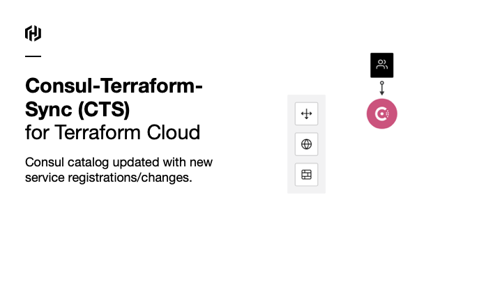
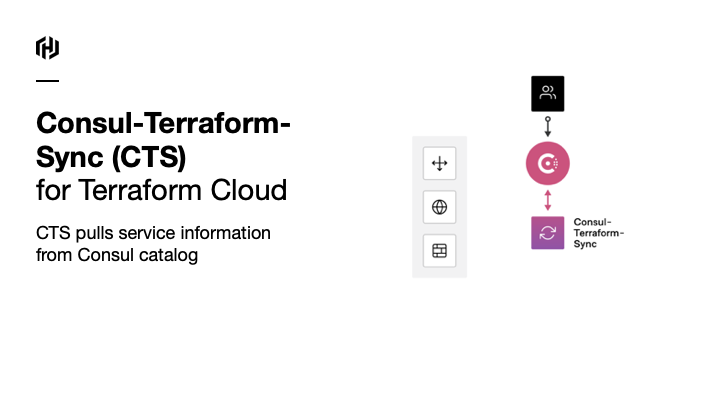
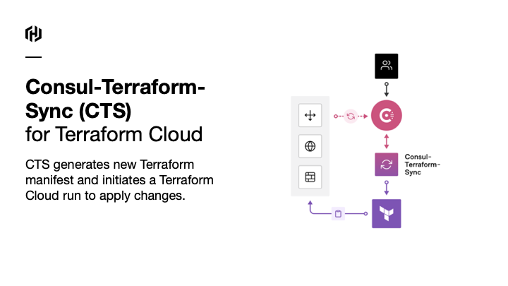

# Fortinet With Consul Network Infrastructure Automation
The follow code/demo provides a highlevel overview on how you can automatically configure address groups on fortinet firewall.

## How Does it Work?
CTS is a lightweight service that watches for changes in Consul. 

### Phase 1
CTS looks out for changes to services and pulls information from the Consul catalog…


### Phase 2
based on the metadata/info from Consul the "Source of Trust", CTS will generate a new Terraform manifest and apply it to the network devices it needs to configure.



### Phase 3
As services go up and down, CTS will automatically update the Address groups on in the forinet firewalls. 
* Elminate human error
* Automate changes in real-time
* Allow SecOPs/IT admins focus on real work not updating address groups




## Let's Deploy
Lets deploy this in your environment

### Prequists 
* Docker install [Optional]. Note: I use docker because Apple M1 /Terraform doesnt support the template provider
* AWS Installed
* export AWS_ACCESS_KEY_ID=<ID>
* export AWS_SECRET_ACCESS_KEY=<SECRET>
* Terraform installed. If you are not using docker

## Lab Overview

## Step 1
Download the git repo

```
git clone https://github.com/maniak-academy/medium-fortigate-aws-nia.git
```

## Step 2
Let's deploy the Forinet Firewall for our lab. For this example will will just build a simple vpc with a single Forigate deployment (Demo, no need for HA).

* Option 1 with Terraform 

```
terraform apply -target=module.security 
```

* Option 2 with Mac M1

```
docker-compose -f docker-compose.yaml run --rm terraform apply -target=module.security 
``` 

Note it takes about 5-7 minutes to spin up the foritgate OS in AWS. Be patient.

The output will look like this. 

```
fortigate_password = <sensitive>
fortigate_public_ip = "https://3.215.158.76:8443"
ssh-foritgate-firewall = "ssh -i terraform-20221021021239128900000001.pem admin@3.215.158.76"
```

## Step 3
FortiOS Provider requires an API token to be authenticated. An API token is generated by creating a new REST API admin.

From the output of applying terraform -apply you will see "ssh-foritgate-firewall" this will allow you to ssh into the Fortigate Firewall and generate an API Token for CTS.

* SSH into the Forigate 
```
ssh -i terraform-20221021021239128900000001.pem admin@3.215.158.76 
```
* Execute the following command

``` 
execute api-user generate-key tfapi 
```
* exit out of the forigatew firewall

Output will show you the New API KEY: 

```
FGTVM # execute api-user generate-key tfapi

New API key: Qm5kpc1zh1xggQzNgyts1gzGr7dH99

NOTE: The bearer of this API key will be granted all access privileges assigned to the api-user tfapi.
```

* Edit the terraform.tfvars file, and insert the New API Key in the fortigate_token variable. 
``` 
fortigate_token = "Qm5kpc1zh1xggQzNgyts1gzGr7dH99" 
```
* Save the file

## Step 4
Let's deploy the infrastructure. The infrastrucutre consits of 
* Consul + Consul Terraform Sync
* API Web Server
* Web Server

Execute the following command to launch the infrastructure. 

* Option 1 with Terraform 

```
terraform apply -target=module.infra 
```

* Option 2 with Mac M1

```
docker-compose -f docker-compose.yaml run --rm terraform apply -target=module.infra 
``` 


terraform apply -target=module.security 

Next we will need to generate an API token so Consul Terraform Sync can make changes automatically 

run the following command to get the password 

```
docker-compose -f docker-compose.yaml run --rm terraform output -json | jq 
```

Output example...
```
{
  "fortigate_password": {
    "sensitive": true,
    "type": "string",
    "value": "!xYp_fcOp44JekREgLV87P"
  },
  "fortigate_public_ip": {
    "sensitive": false,
    "type": "string",
    "value": "https://52.2.28.250:8443"
  }
}
```

ssh into the forinet device 


Copy the Value and execute the deployment of the apps

docker-compose -f docker-compose.yaml run --rm terraform apply -auto-approve -target=module.infra 

terraform will ask you to input the fortigate token, so paste it in.

```
var.fortigate_token
  Enter a value:!xYp_fcOp44JekREgLV87P
```


NOTE on mac m1 users
if you get this error, you can use docker to deploy the configuration

│ Provider registry.terraform.io/hashicorp/template v2.2.0 does not have a package available for your current platform, darwin_arm64.
First, make sure that you have docker installed on your machine.. than you can execute the following command.

docker-compose -f docker-compose.yaml run --rm terraform init

docker-compose -f docker-compose.yaml run --rm terraform plan

docker-compose -f docker-compose.yaml run --rm terraform apply